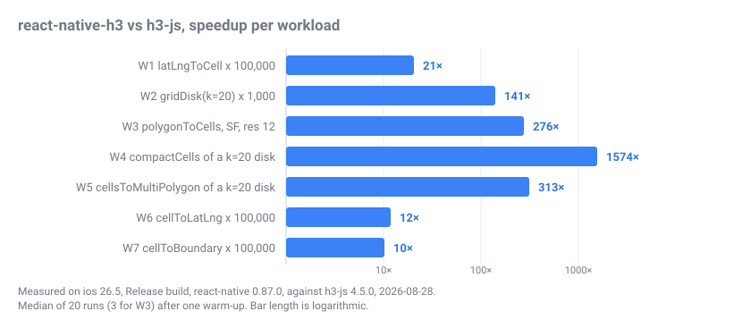
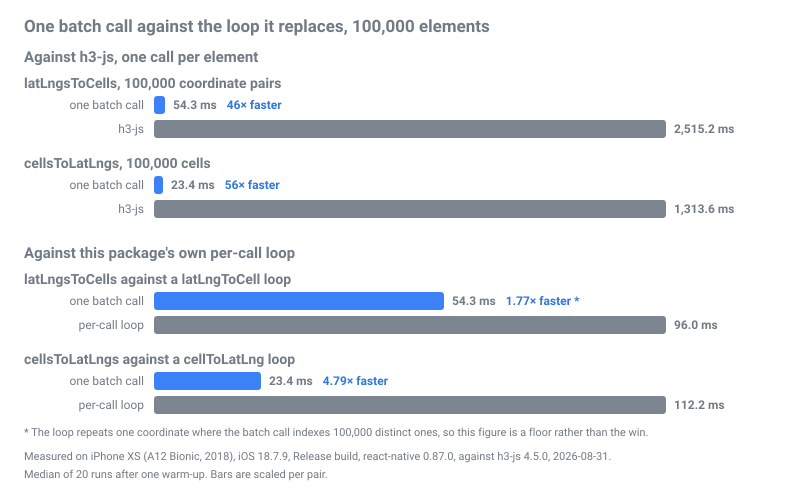

# 📊 Benchmark Report

> **Audience: anyone checking the numbers.** This page is the evidence behind the README's
> performance claims: what was measured, how, on which devices, where the data lives, and how to
> reproduce it.

## Source of truth

Both libraries run in the same app, in the same Hermes instance, against the same inputs, in a
Release build on a physical phone.

- **Payload.** The iPhone XS run, the run the README carries, is committed as
  `apps/example/benchmark.json`.
- **Charts.** `img/benchmark.svg` and `img/benchmark-batch.svg` are rendered from that payload by
  `bun run benchmark:svg`.
- **Second device.** The Galaxy S23 run is a second measurement on a second device. The repository
  keeps one payload file, so its figures live in the results tables below rather than in a committed
  payload, and no chart is rendered from them.
- **Run conditions.** The device state in each provenance block is recorded from the device during
  the run, because the payload does not carry it.

## Headline metric

The README reports the largest measured speedup: `compactCells` at 807× on the iPhone XS.

This workload is intentionally included because it exposes the cost of crossing the
JavaScript/Emscripten boundary with large cell sets.

The complete workload matrix is reported below.

## 🔬 Methodology

To ensure apples-to-apples comparisons, both libraries (`react-native-nitro-h3` and `h3-js`) are
imported into the exact same Benchmark screen (`apps/example/src/BenchmarkScreen.tsx`). They run
inside the same app, the same Hermes instance, against the exact same inputs, just seconds apart.
Nothing is compared across different processes, machines, or days.

### 1. Execution Strictness

- **Release Builds Only:** A Debug build slows the native side several times over, so its numbers
  are not comparable. The screen reads `__DEV__` and records `Debug` or `Release` in the payload,
  and `bun run benchmark:svg` refuses a Debug payload.
- **Detailed Telemetry:** The payload records `measuredOn` metadata (platform, device model on
  Android, OS, React Native and Hermes versions, h3-js version, date, warm-up count, duration)
  written by the screen, not by hand.

### 2. The Measurement Loop

Each workload is timed using the following sequence:

- **Warm-up:** One untimed warm-up pass so neither library pays the initialisation cost of its first
  call.
- **Timed Passes:** 20 timed passes for most workloads. (Exceptions: `W3` and `W2d` get three
  passes, as a single `h3-js` run of either takes seconds; `W0` takes 1,000 passes of one call.)
- **Event Loop Yielding:** Between samples, the thread yields to the event loop. This prevents the
  app from freezing during minutes-long runs. The pause occurs strictly outside the timed windows.
  (Exception: `W0` yields every hundredth sample, because a macrotask costs more than the single
  call it would separate.)
- **Statistical Aggregation:** The published figure is the median (the upper of the two middle
  samples on an even count). The p95 (by nearest rank, the 19th sample out of 20), minimum, and
  maximum are recorded beside it. A `W0` sample is one call, so its median and p95 describe a single
  call rather than a pass.

### 3. Strict Equivalence Validation

Speed means nothing if the answer is wrong. Result equivalence is checked outside the timed loop,
from the warm-up value or a fresh untimed pass:

- **Cells:** Compared as sorted, lowercase hexadecimal strings (the only representation both
  libraries can be brought to without timing the conversion).
- **Coordinates and Boundaries:** Compared component by component with a tolerance of `1e-9`
  degrees.
- **Order:** Sorted for a set of cells, in order for `W10`, where the path is the answer.
- **Batch Rows:** `W11`'s cells are compared with `h3-js`'s element by element in input order, and
  `W12`'s centres component by component within `1e-9` degrees.
- **Async Parity:** The async `W3` and `W8` rows have no `h3-js` counterpart, so their output is
  validated against the synchronous result of the same workload.

> **Note:** A run that fails validation is marked `RESULTS DIFFER FROM h3-js` in the screen's
> caption and must not be published.

### 4. What Each Workload Covers

The set is chosen so the headline rows can be read in context rather than alone:

- `W0` is the map tap: one call per sample, where no batch hides the cost of a single crossing.
- `W2a` to `W2d` vary `k` over the same loop, so a factor can be read against the work one call
  does.
- `W6` and `W7` cycle the 1,261 cells of a `k=20` disk rather than one repeated cell.
- `W8` sizes its result with `cellToChildrenSize` before the run and targets the highest resolution
  that stays inside a 4,000,000 cell budget the benchmark sets for itself, so the row label names
  the resolution actually measured. On both runs below the target resolution 12 fits, at 410,914
  cells.
- `W11` and `W12` have no `h3-js` counterpart, so each is compared against 100,000 individual
  `h3-js` calls doing the same work.

### 5. Chart Rules

- **Paired Bars:** `img/benchmark.svg` shows the four headline workloads (`W1`, `W3`, `W4` and `W7`)
  as paired bars, `react-native-nitro-h3` above `h3-js`, each pair scaled linearly so the `h3-js`
  bar spans the full width. The remaining workloads are in the tables below.
- **The Batch Chart:** `img/benchmark-batch.svg` is rendered from the same payload and puts one batch
  call against the `h3-js` loop and against this package's own per-call loop. Its `W1` against `W11`
  pair carries a footnote, because that pair is not input-matched; see The Batch Rows below.
- **Where the Headline Comes From:** `bun run benchmark:svg` prints the widest factor of a payload
  as a `HEADLINE` line; the screen reports rows and their per-row factors and nothing else. Which
  factor deserves a headline is a judgement made when the numbers are published, not by the app that
  measures them.
- **A Payload Keeps Its Factors:** a payload whose rows carry a `factor` field is published with
  the factor the screen displayed, because recomputing one from medians rounded for the screen
  drifts from what was measured.

### 6. The Workload Ids

| Id | Workload |
|---|---|
| `W0` | `latLngToCell`, 1 call per sample, 1,000 samples |
| `W1` | `latLngToCell`, 100,000 calls |
| `W2` | `gridDisk(k=20)`, 1,000 calls |
| `W2a` to `W2d` | `gridDisk` at `k` of 1, 5, 10 and 50, 1,000 calls each |
| `W3` | `polygonToCells`, San Francisco at res 12, sync and async |
| `W4` | `compactCells`, `k=20` disk |
| `W5` | `cellsToMultiPolygon`, `k=20` disk |
| `W6` | `cellToLatLng`, 100,000 calls |
| `W7` | `cellToBoundary`, 100,000 calls |
| `W8` | `uncompactCells`, San Francisco res 9 to res 12, sync and async |
| `W9` | `cellToChildren`, res 5 to res 10 |
| `W10` | `gridPathCells`, Berlin to Hamburg at res 9, 1,000 calls |
| `W11` | `latLngsToCells`, 100,000 coordinate pairs in one call |
| `W12` | `cellsToLatLngs`, 100,000 cells in one call |

## 📈 Results



Both runs are hand-run on a physical phone in a Release build. CI does not produce these figures: an
emulator on a shared runner says nothing about a phone. All timing figures represent the median
execution time in milliseconds, and the speedup factor is the `h3-js` median divided by the
`react-native-nitro-h3` median. Both devices ran the same binary, built from commit `7f5d93d`, and
both were on wired USB power for the whole run.

### iPhone XS, iOS 18.7.9, 2026-08-31

| Field | Value |
|---|---|
| Device | iPhone XS (`iPhone11,2`), Apple A12 Bionic, 2018, 4 GB RAM |
| Platform | iOS 18.7.9 (build `22H355`) |
| Build Type | Release |
| React Native | 0.87.0, Hermes 250829098.0.16 |
| Target | `h3-js` 4.5.0 (the same H3 v4.5.0 C core this package vendors) |
| Duration | 1,262 seconds |
| Passes | 1 warm-up pass, then 20 timed runs per workload (3 for the two `W3` rows and `W2d`, 1,000 single calls for `W0`) |
| Power | wired USB throughout, and therefore charging, with the screen on and the Benchmark tab in the foreground |
| Thermal | not recorded: iOS 18.7.9 exposes neither battery level nor thermal state to the host |
| Equivalence | 19 of 19 rows |

| Workload | react-native-nitro-h3 | h3-js | Speedup | Eq. | Detail |
|---|---:|---:|---:|:-:|---|
| **W0:** `latLngToCell` (per call) | **0.004 ms** | 0.033 ms | **7.6×** | ✅ | 1,000 distinct inputs, 0.0002 ms baseline subtracted, p95 0.008 ms against 0.048 ms |
| **W1:** `latLngToCell` (100k) | **96.0 ms** | 2,448.6 ms | **25×** | ✅ | Returns `89283082803ffff` |
| **W2:** `gridDisk(k=20)` (1,000×) | **32.6 ms** | 5,562.4 ms | **171×** | ✅ | 1,261 cells per call |
| **W2a:** `gridDisk(k=1)` (1,000×) | **2.2 ms** | 31.4 ms | **14×** | ✅ | 7 cells per call |
| **W2b:** `gridDisk(k=5)` (1,000×) | **3.8 ms** | 404.5 ms | **105×** | ✅ | 91 cells per call |
| **W2c:** `gridDisk(k=10)` (1,000×) | **7.8 ms** | 1,450.3 ms | **187×** | ✅ | 331 cells per call |
| **W2d:** `gridDisk(k=50)` (1,000×) | **176.8 ms** | 34,036.4 ms | **192×** | ✅ | 7,651 cells per call |
| **W3:** `polygonToCells` (SF, res 12) | **233.8 ms** | 78,805.6 ms | **337×** | ✅ | 412,377 cells |
| **W3:** `polygonToCellsAsync` (SF, res 12) | **244.7 ms** | n/a | n/a | ✅ | 412,377 cells |
| **W4:** `compactCells` (k=20 disk) | **0.100 ms** | 81.0 ms | **807×** | ✅ | 1,261 cells in, 163 cells out |
| **W5:** `cellsToMultiPolygon` (k=20 disk) | **2.0 ms** | 406.8 ms | **203×** | ✅ | 1 polygon |
| **W6:** `cellToLatLng` (100k) | **112.2 ms** | 1,298.4 ms | **12×** | ✅ | Over 1,261 distinct cells |
| **W7:** `cellToBoundary` (100k) | **425.3 ms** | 3,742.0 ms | **8.8×** | ✅ | Over 1,261 distinct cells |
| **W8:** `uncompactCells` (SF res 9 to res 12) | **3.8 ms** | 1,238.0 ms | **325×** | ✅ | 190 cells in, 410,914 cells out |
| **W8:** `uncompactCellsAsync` (SF res 9 to res 12) | **3.8 ms** | n/a | n/a | ✅ | 190 cells in, 410,914 cells out |
| **W9:** `cellToChildren` (res 5 to res 10) | **0.225 ms** | 48.9 ms | **217×** | ✅ | 16,807 children of `85283083fffffff` |
| **W10:** `gridPathCells` (Berlin to Hamburg, res 9, 1,000×) | **314.9 ms** | 16,253.9 ms | **52×** | ✅ | 914 cells per path |
| **W11:** `latLngsToCells` (100k pairs) | **54.3 ms** | 2,515.2 ms | **46×** | ✅ | 100,000 pairs in one call against 100,000 `h3-js` calls |
| **W12:** `cellsToLatLngs` (100k cells) | **23.4 ms** | 1,313.6 ms | **56×** | ✅ | 100,000 cells in one call against 100,000 `h3-js` calls |

**Data provenance.** The figures above are transcribed from the on-device results screen, so the
medians carry the precision the screen renders: one decimal above a millisecond, three below. No
percentiles are reported for this run beyond `W0`, and the Speedup column is the factor the screen
computed from the unrounded medians. `apps/example/benchmark.json` records this in its `source`
field.

### Samsung Galaxy S23, Android 16, 2026-08-31

| Field | Value |
|---|---|
| Device | Samsung Galaxy S23 (`SM-S911U1`), Qualcomm `kalama` |
| Platform | Android 16, API 36 |
| Run date | 2026-08-31, 00:50 to 01:00 CEST; the raw payload's `date` field reads 2026-08-30, the UTC date |
| Build Type | Release |
| React Native | 0.87.0, Hermes 250829098.0.16 |
| Target | `h3-js` 4.5.0 (the same H3 v4.5.0 C core this package vendors) |
| Duration | 567.1 seconds |
| Passes | 1 warm-up pass, then 20 timed runs per workload (3 for the two `W3` rows and `W2d`, 1,000 single calls for `W0`) |
| Power | wired USB throughout on an already full battery, with the screen kept on and the Benchmark tab in the foreground |
| Thermal | entered the run at `Thermal Status: 0` and never left it; battery temperature rose from 30.9 °C to a 37.6 °C plateau at minute six, so the second half of the run measured a thermally steady phone |
| Equivalence | 19 of 19 rows |

| Workload | react-native-nitro-h3 | h3-js | Speedup | p95 (RN) | p95 (JS) | Eq. | Detail |
|---|---:|---:|---:|---:|---:|:-:|---|
| **W0:** `latLngToCell` (per call) | **0.0023 ms** | 0.0269 ms | **11.5×** | 0.0043 ms | 0.0353 ms | ✅ | 1,000 distinct inputs, 0.0002 ms baseline subtracted |
| **W1:** `latLngToCell` (100k) | **78.2 ms** | 930.1 ms | **11.9×** | 78.4 ms | 937.2 ms | ✅ | Returns `89283082803ffff` |
| **W2:** `gridDisk(k=20)` (1,000×) | **21.3 ms** | 2,278.7 ms | **106.8×** | 32.2 ms | 2,286.0 ms | ✅ | 1,261 cells per call |
| **W2a:** `gridDisk(k=1)` (1,000×) | **2.4 ms** | 21.0 ms | **8.7×** | 3.0 ms | 24.9 ms | ✅ | 7 cells per call |
| **W2b:** `gridDisk(k=5)` (1,000×) | **3.7 ms** | 164.0 ms | **44.4×** | 4.8 ms | 164.6 ms | ✅ | 91 cells per call |
| **W2c:** `gridDisk(k=10)` (1,000×) | **9.6 ms** | 589.7 ms | **61.6×** | 16.8 ms | 594.0 ms | ✅ | 331 cells per call |
| **W2d:** `gridDisk(k=50)` (1,000×) | **122.3 ms** | 14,118.6 ms | **115.5×** | 126.6 ms | 15,062.7 ms | ✅ | 7,651 cells per call |
| **W3:** `polygonToCells` (SF, res 12) | **176.0 ms** | 25,568.8 ms | **145.3×** | 177.3 ms | 26,768.3 ms | ✅ | 412,377 cells |
| **W3:** `polygonToCellsAsync` (SF, res 12) | **244.3 ms** | n/a | n/a | 246.9 ms | n/a | ✅ | 412,377 cells |
| **W4:** `compactCells` (k=20 disk) | **0.138 ms** | 28.4 ms | **205.9×** | 0.173 ms | 29.4 ms | ✅ | 1,261 cells in, 163 cells out |
| **W5:** `cellsToMultiPolygon` (k=20 disk) | **1.9 ms** | 146.9 ms | **78.7×** | 2.5 ms | 147.1 ms | ✅ | 1 polygon |
| **W6:** `cellToLatLng` (100k) | **103.1 ms** | 639.2 ms | **6.2×** | 103.8 ms | 666.8 ms | ✅ | Over 1,261 distinct cells |
| **W7:** `cellToBoundary` (100k) | **327.9 ms** | 2,021.7 ms | **6.2×** | 328.8 ms | 2,126.4 ms | ✅ | Over 1,261 distinct cells |
| **W8:** `uncompactCells` (SF res 9 to res 12) | **3.5 ms** | 787.9 ms | **227.7×** | 4.4 ms | 795.2 ms | ✅ | 190 cells in, 410,914 cells out |
| **W8:** `uncompactCellsAsync` (SF res 9 to res 12) | **4.8 ms** | n/a | n/a | 6.1 ms | n/a | ✅ | 190 cells in, 410,914 cells out |
| **W9:** `cellToChildren` (res 5 to res 10) | **0.125 ms** | 26.6 ms | **213.5×** | 0.137 ms | 28.2 ms | ✅ | 16,807 children of `85283083fffffff` |
| **W10:** `gridPathCells` (Berlin to Hamburg, res 9, 1,000×) | **202.3 ms** | 8,247.5 ms | **40.8×** | 205.0 ms | 8,776.5 ms | ✅ | 914 cells per path |
| **W11:** `latLngsToCells` (100k pairs) | **47.7 ms** | 1,376.8 ms | **28.9×** | 49.6 ms | 1,386.5 ms | ✅ | 100,000 pairs in one call against 100,000 `h3-js` calls |
| **W12:** `cellsToLatLngs` (100k cells) | **19.9 ms** | 679.3 ms | **34.1×** | 20.0 ms | 852.5 ms | ✅ | 100,000 cells in one call against 100,000 `h3-js` calls |

> **Rows Under 10 Milliseconds:** `W0`, `W2a` to `W2c`, `W4`, `W5`, `W8` and `W9` finish in under
> ten milliseconds on the native side, and each device figure is a single run. Repeating a run on the
> same device with the same build moved the factors of those rows by up to half; the rows in the
> hundreds of milliseconds moved considerably less. Read a factor as an order of magnitude, not as a
> constant.

> **The First Workload:** `W0` runs first and times a single call rather than a pass, so both of
> its medians are measured on a phone that has just come out of idle.

> **The Cost of a Thread Hop:** `polygonToCellsAsync` has no `h3-js` counterpart. `h3-js` does
> not offer async variants, and timing its synchronous call as if it were async would skew the
> comparison. Instead, this row documents the cost of offloading work to a background thread: about
> 11 ms on the 234 ms `W3` call on the iPhone XS, where `W8` is indistinguishable from its
> synchronous sibling at 3.8 ms, and about 68 ms on the 176 ms `W3` call on the Galaxy S23, with
> 1.4 ms on its 3.5 ms `W8` call.

### The Batch Rows



`W11` and `W12` answer a different question from the rest of the table. The comparison that matters
for a batch call is not its `h3-js` factor but the batch against this package's own per-call loop,
over the same amount of work in the same run.

| Operation | per-call loop | one batch call | batch wins |
|---|---:|---:|---:|
| coordinate to cell, 100,000, iPhone XS | `W1` 96.0 ms | `W11` 54.3 ms | **1.77×** |
| cell to centre, 100,000, iPhone XS | `W6` 112.2 ms | `W12` 23.4 ms | **4.79×** |
| coordinate to cell, 100,000, Galaxy S23 | `W1` 78.2 ms | `W11` 47.7 ms | **1.64×** |
| cell to centre, 100,000, Galaxy S23 | `W6` 103.1 ms | `W12` 19.9 ms | **5.18×** |

Read the two pairs differently, because only one of them is input-matched:

- **`W6` against `W12` is a clean pair.** The `h3-js` sides bracket each other closely on both
  devices, 1,298.4 ms against 1,313.6 ms on the iPhone XS and 639.2 ms against 679.3 ms on the
  Galaxy S23, which is the evidence that the two workloads are comparable despite `W6` cycling 1,261
  distinct cells where `W12` uses 100,000.
- **`W1` against `W11` is not, and its figure is a floor.** `W1` repeats one coordinate 100,000
  times where `W11` uses 100,000 distinct ones, so the batch call does the harder work. The `h3-js`
  sides show it: 2.7 % apart on the iPhone XS, 48 % apart on the Galaxy S23. Quote 1.77× as a lower
  bound, never as the win. A `W1` variant fed the same 100,000 distinct coordinates is the clean way
  to get the real figure, and that variant does not exist yet.
- **The saving is bridge crossings, not a faster inner loop.** Host measurements put the native work
  of a batch call within about 2 % of the native work of the loop it replaces, so what the batch
  removes is the per-element crossing: roughly 0.42 and 0.89 microseconds per element on the A12,
  0.30 and 0.83 on the Galaxy S23.
- **`cellsToLatLngs` wins more than `latLngsToCells`** on both devices, because its scalar sibling
  returns a fresh coordinate object per call, which is the expensive crossing, where the batch
  returns one `Float64Array`.
- **100,000 elements is a favourable size by construction.** Below a few hundred, one crossing plus
  a typed-array allocation is a larger share of the total, and that crossover is unmeasured.
  Building the input `Float64Array` is not timed on either side either, so a caller who assembles
  one from JavaScript objects pays for that on top.

## The Size Ledger

Replacing `h3-js` trades JavaScript for machine code. Measured on 2026-08-30 from `apps/example`
with React Native 0.87.0, Hermes 250829098.0.16, `h3-js` 4.5.0 and `react-native-nitro-h3` 0.1.0:

| Item | Size |
|---|---:|
| Hermes bytecode dropped with `h3-js` | 271 kB |
| Hermes bytecode added by the `react-native-nitro-h3` JavaScript side | 39 kB |
| `libNitroH3.so`, `arm64-v8a` | 794 kB |
| `libNitroH3.so`, `armeabi-v7a` | 583 kB |
| `libNitroH3.so`, `x86_64` | 813 kB |
| `libNitroH3.so`, `x86` | 829 kB |

The bytecode figures come from two Metro bundles of the example app that differ only in whether
`apps/example/src/BenchmarkScreen.tsx` imports `h3-js`, each compiled with `hermesc -O -emit-binary
-output-source-map` (React Native's own production flags). The native figures are the stored sizes
in `apps/example/android/app/build/outputs/apk/release/app-release.apk`, of which 333 kB on
`arm64-v8a` is executable code and the rest is read-only data, symbol tables and C++ unwind
information. An Android App Bundle ships one ABI per device, so a phone pays one of those rows, not
four; an app with no other Nitro module also carries `libNitroModules.so` from
`react-native-nitro-modules` (980 kB on `arm64-v8a`). iOS was not measured.

## The Cost of Unbounded Requests (What the Cell Ceiling Guards)

Neither library caps a request by default. `h3-js` bounds only its own WebAssembly allocation at
2 GB, building JavaScript arrays of hexadecimal strings on top of it without a bound, and it offers
no setting to change that. `react-native-nitro-h3` allocates whatever is asked for too, until
`configure({ maxCellCount })` sets a Cell Ceiling; from then on an oversized request is refused
before anything is allocated.

To show what an unbounded request costs, the numbers below come from hardware far larger than a
phone (Apple M5 Pro, 24 GB RAM, macOS 26.5.2, bun 1.3.14, from
`latLngToCell(37.7749, -122.4194, 9)`, measured 2026-08-28):

| Call | Cells | Packed Size | Wall Clock |
|---|---:|---:|---:|
| `gridDisk(cell, 2000)` | 12,006,001 | 96 MB | 1.14 s |
| `gridDisk(cell, 4000)` | 48,012,001 | 384 MB | 6.16 s |

**Context:** "Packed size" is the memory footprint if those cells were stored as 64-bit integers
(8 bytes each). As an array of hexadecimal strings in `h3-js` they cost considerably more, which is
where the wall-clock time is largely spent. `gridDisk(cell, 8000)` (192,024,001 cells) was not run:
the array of strings it builds forces even an M5 Pro into swap.

> **The Mobile Reality:** A phone has neither that memory nor those seconds to spare, and the
> allocation happens inside the app's own heap. When it fails, the OS kills the process; no
> JavaScript `try/catch` sees it. That is exactly what a Cell Ceiling guards against:
> `react-native-nitro-h3` sizes every result up front, so a ceiling can refuse the request with a
> catchable `H3Error`.

## Regenerating the Benchmarks

To reproduce these numbers yourself:

### 1. Build and Run

Build the example app in Release mode and open the Benchmark screen. Press **Run benchmark**. The
run takes about nine minutes on a Galaxy S23 and about twenty-one on an iPhone XS; the screen stays
usable between samples, but each `h3-js` `W3` pass blocks the JavaScript thread for tens of seconds.

On a physical iOS device, capture the payload before the run rather than after it: relaunching the
app to reach the log discards the results, which live only in the screen's own state.

### 2. Extract the Payload

When finished, the screen prints a Markdown table to the log, then a caption naming the platform,
the build type and the versions, then the raw JSON payload.

Because the iOS unified log truncates a message at about a kilobyte, the payload is chunked into
lines of the form:

```text
BENCHMARK_JSON <i>/<total> |<chunk>|
```

The chunking does not depend on the platform, so an Android run prints the same lines to `logcat`.

**Note:** The `|` bars pin both edges of each chunk, because the log trims outer whitespace. Take
the text between the bars, in numerical order, and concatenate it with nothing in between.

### 3. Process and Validate

Save the concatenated result as `apps/example/benchmark.json` (pretty-printed with 2 spaces). Then
run:

```sh
bun run benchmark:svg
```

The script validates the JSON (and refuses a `Debug` payload), renders both charts
(`img/benchmark.svg` and `img/benchmark-batch.svg`), and prints the widest factor of the payload as a
`HEADLINE` line.

### 4. Publish

Put that factor in the README's Performance section, beside the device and the date, and update the
methodology note from the new JSON. Update this document's results table for that device, and its
provenance block from the conditions recorded during the run.

If the payload could not be recovered and the figures come off the screen instead, say so in the
provenance block, set the payload's `source` field, and give each row the `factor` the screen showed
rather than one recomputed from the rounded medians.

> **Pre-Flight Check:** Before publishing, check the caption. If it says `Debug` or carries a
> `RESULTS DIFFER FROM h3-js` warning, the run is compromised and must not be published.
